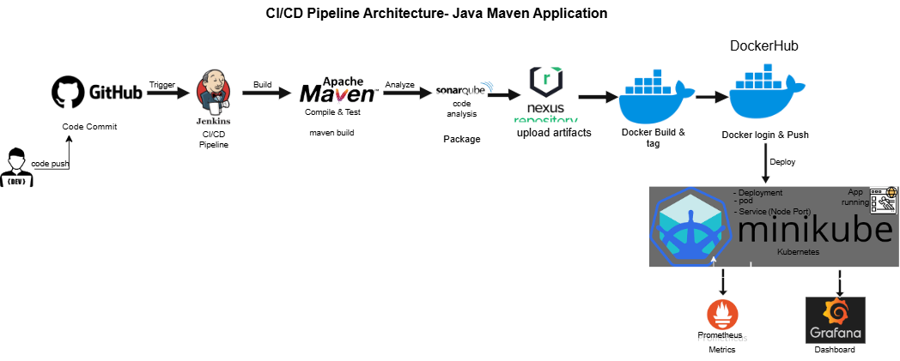

## 🚀 Java Maven CI/CD Pipeline with Kubernetes Monitoring

## 📌 Project Overview

This project demonstrates a complete **CI/CD pipeline** for a Java Spring Boot application using DevOps tools.
The pipeline automates build, code quality analysis, artifact storage, containerization, deployment, and monitoring.


## 🛠️ Tools & Technologies Used

- **Cloud**: AWS EC2
- **CI/CD**: Jenkins
- **Build Tool**: Maven
- **Code Quality**: SonarQube
- **Artifact Repository**: Nexus
- **Containerization**: Docker
- **Orchestration**: Kubernetes (Minikube)
- **Monitoring**: Prometheus & Grafana


## ⚙️ CI/CD Pipeline Flow

1. Developer pushes code to GitHub
2. Jenkins triggers pipeline
3. Maven builds the application
4. SonarQube performs code analysis
5. Artifact is stored in Nexus
6. Docker image is built
7. Image is deployed to Kubernetes (Minikube)
8. Application is exposed via service
9. Prometheus collects metrics
10. Grafana visualizes monitoring data
    
## Architecture Diagram




## 🧩 Project Structure

```
project/
│
├── src
├── screenshots
├── Dockerfile
├── Jenkinsfile
├── k8s
├── pom.xml
├── Architecture
├── README.md
├── Architecture


``` 


## 📸 Project Screenshots

👉 Detailed screenshots available here:
➡️ screenshots/README.md

Includes:

* Jenkins Pipeline Success
* Application Running
* Kubernetes Pods & Services
* Prometheus Targets
* Grafana Dashboards
* SonarQube Quality Gate
* Nexus Artifacts


## 📊 Key Features

* ✅ Fully automated CI/CD pipeline
* ✅ Code quality analysis using SonarQube
* ✅ Artifact versioning with Nexus
* ✅ Docker-based containerization
* ✅ Kubernetes deployment (Minikube on EC2)
* ✅ Real-time monitoring using Prometheus & Grafana

---

## 🚀 How to Run (High Level)

1. Launch EC2 instance
2. Install Docker, Jenkins, Minikube
3. Configure SonarQube & Nexus
4. Setup Jenkins pipeline
5. Deploy using Kubernetes manifests
6. Access app via NodePort


## 📈 Monitoring

* **Prometheus** → Collects metrics from cluster
* **Grafana** → Visualizes CPU, Memory, Pod status


## 🎯 Outcome

This project demonstrates real-world DevOps practices including:

* CI/CD automation
* Microservices deployment
* Monitoring & observability
* Cloud-based infrastructure

---

## 👨‍💻 Author

Akshay
DevOps Engineer (Fresher)
